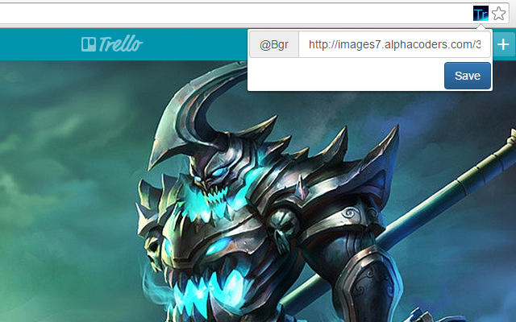

##Description

This Google Chrome extension is made for changing Trello background image or color.

##How to use

- Clone this repository to a folder, e.g. <code>.../TrelloBC/</code>
- Enable <code>Developer mode</code> in <code>chrome://extensions/</code>
- Click <code>Load unpacked extension...</code> then point to the folder of repository.
- Open [Trello](https://trello.com/) then click to the extension's icon (as screen shot above).
- To set background color, use a CSS color (<code>#123</code> or <code>#ff3381</code> or <code>rgb(212, 18, 110)</code>).
- To set background image, type just a image url to the box (e.g.<code>http://images7.alphacoders.com/333/333313.jpg</code>)